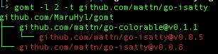

# gomt
Base on `go mod graph` but with better human readability



## Installation

```sh
go get github.com/MaruHyl/gomt/gomt
```

## Command Help
```text
Base on go mod graph but with better human readability.

Usage:
  gomt [flags]

Flags:
  -h, --help            help for gomt
  -j, --json            prints out an JSON representation of the tree
  -l, --max_level int   set max level
  -t, --target string   like go mod why ${Target} but with better human readability
```

## Usage example

### --max_level
Limit the depth of the tree

`gomt -l 1`

output
```
github.com/MaruHyl/gomt
├── github.com/fatih/color@v1.7.0
├── github.com/mattn/go-colorable@v0.1.1
├── github.com/mattn/go-isatty@v0.0.8
└── github.com/spf13/cobra@v0.0.4
```

### --json
Print json format

`gomt -l 1 -j`

output
```text
{
 "Mod": "github.com/MaruHyl/gomt",
 "Version": "",
 "Deps": [
  {
   "Mod": "github.com/fatih/color",
   "Version": "v1.7.0"
  },
  {
   "Mod": "github.com/mattn/go-colorable",
   "Version": "v0.1.1"
  },
  {
   "Mod": "github.com/mattn/go-isatty",
   "Version": "v0.0.8"
  },
  {
   "Mod": "github.com/spf13/cobra",
   "Version": "v0.0.4"
  }
 ]
}
```

### --target
Like go mod why ${Target} but with better human readability

`gomt -t github.com/mattn/go-isatty`

output
```text
github.com/MaruHyl/gomt
├── github.com/mattn/go-colorable@v0.1.1
│   └── github.com/mattn/go-isatty@v0.0.5
└── github.com/mattn/go-isatty@v0.0.8
```